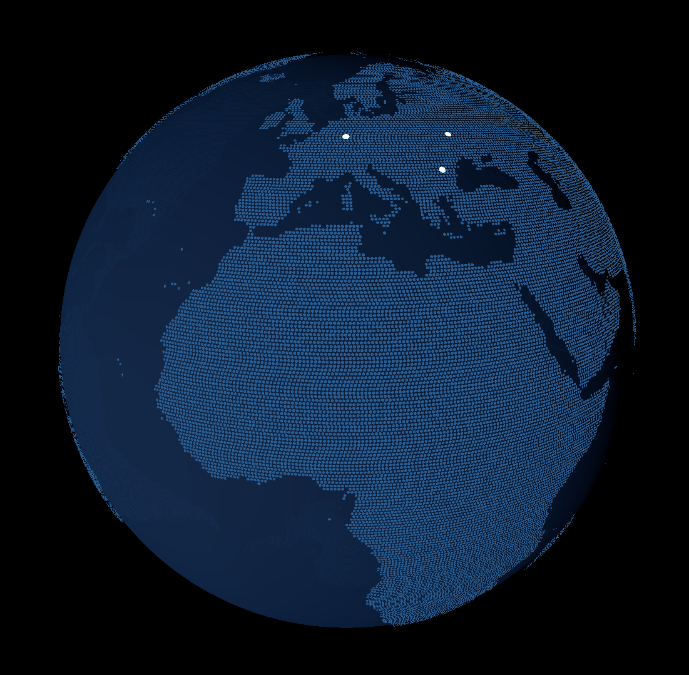

# Anbu Globe
Github had such a globe on their landing page and I thought it was cool.
This project is a small Vite + TypeScript + Three.js demo that renders an interactive 3D globe in the browser.
The globe auto-rotates, places a few city markers on the surface, and shows a tooltip when a marker is hovered.
Built without AI and I'm proud of it.

## Run locally

```bash
npm install
npm run dev
```

## How the globe is built

The globe is assembled in `src/Globe.ts` with a few separate pieces:

- A `THREE.Scene`, `PerspectiveCamera`, and `WebGLRenderer` create the basic Three.js setup.
- A large `SphereGeometry` with a `MeshPhongMaterial` forms the main ocean sphere.
- A directional light is positioned from the current sun latitude and longitude so the globe has a day/night highlight.
- Orbit controls handle camera movement and enable slow automatic rotation.


### Sun latitude and longitude

The light position uses a simplified sun model from `src/utils.ts`.

- The latitude is approximated with a cosine curve over the day of the year, so the sun moves between about `+23.44` and `-23.44` degrees to mimic the Earth's axial tilt across the seasons.
- The longitude is derived from the current UTC time, moving `360 / 24 = 15` degrees per hour, with noon UTC used as the baseline.
- Those latitude/longitude values are converted into 3D Cartesian coordinates and used to place the Three.js directional light around the globe.

The formulas used in the code are:

$$
	ext{latitude} = 23.44 \cdot \cos\left(\frac{2\pi(\text{dayOfYear} - 172)}{365.25}\right)
$$

$$
	ext{longitude} = (\text{timeInHours} - 12) \cdot \frac{360}{24} + 1
$$

The light position is then computed with:

$$
x = r \cos(\text{lat}) \cos(\text{lon})
$$

$$
y = r \cos(\text{lat}) \sin(\text{lon})
$$

$$
z = r \sin(\text{lat})
$$

where $r$ is the light distance from the globe center, and $\text{lat}$ and $\text{lon}$ are interpreted in degrees and converted to radians inside the helper function.

This is a visual approximation rather than an astronomy-precision solar calculation, but it produces a believable moving highlight for the globe.


### The dotted land

1. The app loads `public/eq_proj.png` into a canvas and reads its pixel data.
2. It distributes around 200,000 sample points over a slightly larger sphere.
3. Each point is converted to UV coordinates with the helper functions in `src/utils.ts`.
4. The matching pixel is sampled from the map image.
5. If that pixel is visible, the code places a tiny circular mesh at that position.
6. All accepted dots are merged into one geometry for better rendering performance.

City indicators are added separately as small circular meshes placed from latitude/longitude coordinates. A raycaster tracks pointer hover so the app can pause rotation and show the tooltip text for the active marker.




